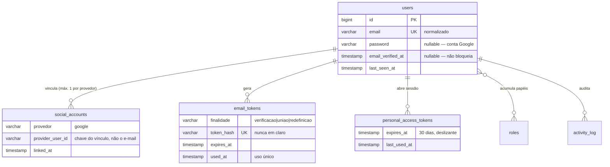

# Phase 1 — Modelo de dados: Fundação de Contas e Autenticação

**Spec**: [spec.md](./spec.md) · **Plano**: [plan.md](./plan.md) · **Data**: 2026-08-30

Banco único (ADR-0001), MySQL 8.4.7, InnoDB forçado em `api/config/database.php` (E-003).
O estado atual das tabelas foi lido do banco real antes de projetar — ver
[research.md](./research.md) §0.

---

## Visão geral

| Tabela | Origem | O que sustenta |
|---|---|---|
| `users` | **existe** — ganha colunas | a conta única (RN-PLAT-001) |
| `social_accounts` | **nova** | vínculo com o Google (RN-PLAT-002) |
| `email_tokens` | **nova** | verificação, união e redefinição (D1, D5, D6) |
| `personal_access_tokens` | **existe** (Sanctum) | sessão com prazo deslizante (D7) |
| `password_reset_tokens` | **existe** (Laravel) | **não usada** — ver nota abaixo |
| `roles` / `permissions` / `model_has_roles` | **novas** (pacote) | papéis sobre a mesma conta |
| `activity_log` | **nova** (pacote) | auditoria de escrita (RN-PLAT-004) |

**Nota sobre `password_reset_tokens`**: a tabela existe (padrão do Laravel), mas esta
feature usa `email_tokens` para os **três** fluxos de link, em vez de manter um mecanismo
só para senha e outro para o resto. **Julgamento do assistente, não medido**: um mecanismo
único de token de e-mail é mais simples de auditar e testar que dois com semânticas
diferentes. A tabela padrão fica sem uso; removê-la é decisão do Ícaro (não faço isso
sozinho — dado em banco, mesmo vazio, não se apaga por conta própria).

---

## `users` — a conta

Colunas existentes hoje (verificadas): `id`, `name`, `email`, `email_verified_at`,
`password`, `remember_token`, `created_at`, `updated_at`.

**Alterações desta feature:**

| Coluna | Mudança | Por quê |
|---|---|---|
| `email` | passa a guardar **sempre normalizado** (minúsculas, sem espaços nas pontas); mantém índice **único** | RN-PLAT-001 não pode ser burlada por variação de caixa (edge case da spec) |
| `password` | passa a ser **nullable** | conta que nasce pelo Google não tem senha (US2-1); hoje é `NOT NULL` |
| `last_seen_at` | **nova**, nullable | alimenta a política de sessão e o suporte; não é dado sensível |

**Invariantes** (sustentadas por banco + domínio, não só por código):

- **Uma conta por e-mail normalizado** — índice único no banco é a última linha de defesa;
  a normalização acontece no value object `Email` antes de qualquer consulta ou escrita.
- Conta **sem senha e sem vínculo social** não pode existir — toda conta tem ao menos um
  meio de entrada.
- `email_verified_at` nulo **não bloqueia** o uso (D5); conta criada pelo Google nasce com
  ele preenchido (o Google já verificou).

**Papéis**: toda conta recebe o papel `rolezeiro` na criação, via
`spatie/laravel-permission`. A estrutura suporta acúmulo (FR-002) sem nova conta.

---

## `social_accounts` — vínculo com provedor externo

| Coluna | Tipo | Notas |
|---|---|---|
| `id` | bigint unsigned, PK | |
| `user_id` | bigint unsigned, FK → `users.id` | `cascade` on delete **não** se aplica: conta não se exclui (Princípio X) |
| `provider` | varchar(32) | `google` nesta feature; a estrutura já aceita outros |
| `provider_user_id` | varchar(191) | identificador estável **do provedor** |
| `provider_email` | varchar(255), nullable | só para diagnóstico; **não** é a chave |
| `linked_at` | timestamp | quando a união/criação aconteceu |
| `created_at` / `updated_at` | timestamp | |

**Índices**: único em (`provider`, `provider_user_id`); único em (`user_id`, `provider`) —
uma conta tem no máximo **um** vínculo por provedor.

**Decisão de modelagem que importa**: o vínculo é pelo **`provider_user_id`**, não pelo
e-mail. Isso resolve o edge case da spec "e-mail da conta Google mudou desde o vínculo": a
pessoa continua entrando na mesma conta, porque o identificador do Google não muda.

---

## `email_tokens` — links de uso único

Serve aos três fluxos com semântica idêntica: gerar, enviar, validar uma vez, expirar.

| Coluna | Tipo | Notas |
|---|---|---|
| `id` | bigint unsigned, PK | |
| `user_id` | bigint unsigned, FK → `users.id` | |
| `purpose` | varchar(32) | `email_verification` · `credential_merge` · `password_reset` |
| `token_hash` | varchar(64), único | **só o hash** — o valor em claro vai no e-mail e nunca é persistido |
| `expires_at` | timestamp | prazo por finalidade, parâmetro configurável |
| `used_at` | timestamp, nullable | preenchido no primeiro uso — garante uso único |
| `payload` | json, nullable | contexto da união (ex.: provedor a vincular) |
| `created_at` / `updated_at` | timestamp | |

**Índices**: único em `token_hash`; índice em (`user_id`, `purpose`).

**Regras que o modelo sustenta:**

- **Uso único**: um token com `used_at` preenchido é recusado — cobre "link já usado" da
  spec (US3-5, US4-3).
- **Expiração** por finalidade — valores iniciais da spec: união e redefinição **60 min**,
  verificação de e-mail **7 dias**. Ficam em config, nunca hardcoded (Princípio VII).
- **Nunca guardar o token em claro** — só o hash. Se o banco vazar, os links não são
  reutilizáveis.
- Solicitar novo token da mesma finalidade **invalida os anteriores** ainda válidos.

---

## `personal_access_tokens` — a sessão (Sanctum, tabela existente)

Colunas relevantes já presentes (verificadas): `tokenable_type`, `tokenable_id`, `name`,
`token`, `abilities`, `last_used_at`, **`expires_at`**, timestamps.

**Como a D7 é implementada** (o Sanctum **não** tem janela deslizante — research §1):

- Na criação, `expires_at = agora + 30 dias` (parâmetro configurável), passado como 3º
  argumento de `createToken`.
- A cada request autenticada, o middleware `RefreshTokenExpiration` empurra `expires_at`
  para `agora + 30 dias`. `last_used_at` o próprio Sanctum já atualiza.
- `'expiration'` em `config/sanctum.php` **permanece `null`** — se receber valor, ele
  sobrepõe o `expires_at` por token e quebra o deslizamento.

**Revogação** (FR-008, FR-015):

- "Sair" apaga **o token da request atual**.
- Redefinição de senha apaga **todos os outros** tokens da conta, preservando o atual se a
  pessoa acabou de definir a senha autenticada.

**Higiene**: agendar `sanctum:prune-expired --hours=24` (comando nativo, verificado na doc).

---

## `activity_log` — auditoria (pacote, tabela nova)

Registra os eventos da FR-017: conta criada, credenciais unidas, senha definida, senha
trocada, e-mail verificado, sessão revogada.

**Restrição de segurança (Princípio V) — vira teste**: o log guarda **o evento e quem**,
nunca o valor. É PROIBIDO gravar senha, hash de senha, token em claro ou token hash nas
propriedades do log. Para união e troca de senha, registrar apenas que ocorreu.

---

## Diagrama de relações



---

## Transições de estado da conta

```text
                    cadastro e-mail/senha
  (não existe) ─────────────────────────────► ativa, e-mail não verificado
                                                   │
                    login Google (e-mail inédito)  │ abre link de verificação
  (não existe) ─────────────────────────────► ativa, e-mail verificado ◄──┘

  ativa (só senha)  ──login Google c/ mesmo e-mail──► PENDENTE DE UNIÃO
         ▲                                                   │
         └───── cancela / expira (nada muda) ────────────────┤
                                                              │ confirma (senha ou link)
                                                              ▼
                                            ativa, com senha + vínculo Google

  ativa (só Google) ──define senha (sessão ativa)──► ativa, com senha + vínculo Google
```

**"PENDENTE DE UNIÃO" não é estado persistido.** É o estado do *fluxo*, carregado pelo
token de união (`finalidade = uniao_credenciais`). Nada é gravado em `users` nem em
`social_accounts` antes da confirmação — é o que garante o cenário US3-6 (número de contas
com o e-mail permanece exatamente um em qualquer desfecho).

---

## Impacto no modelo conceitual do projeto

`docs/architecture/data-model.md` descreve **User** e **Role/Papel** de forma conceitual e
já previa "credenciais próprias e/ou Google". Esta feature materializa a parte de contas.
O que o documento conceitual ainda **não** citava e passa a existir: `social_accounts` e
`email_tokens`. Atualizar no `/doc-sync` da implementação, não agora — o modelo real só
existe quando a migration rodar.
